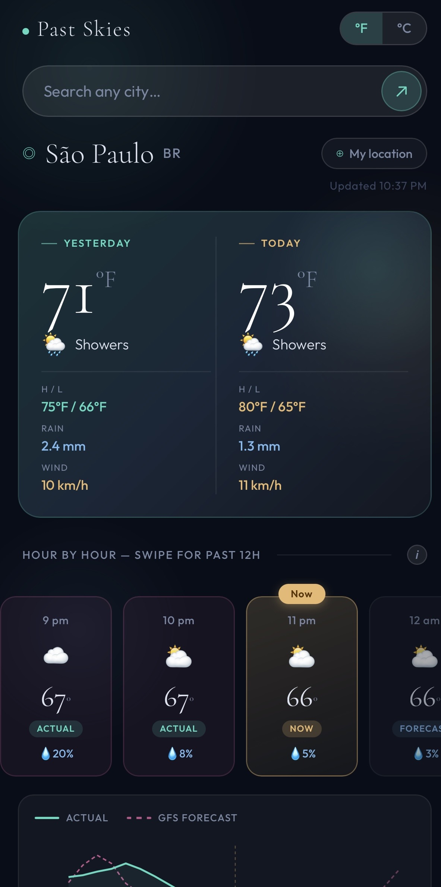
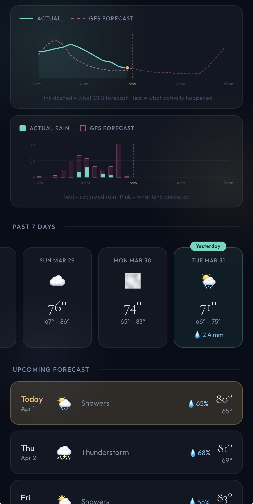

# past-skies
Weather: past, present and future.

Live at https://zeynep-ali.github.io/past-skies

You can use most weather apps to see what the weather is tomorrow; how about what it actually was yesterday, and whether the forecast got it right? This is a mobile app that brings together the actual weather from the past seven days alongside the weather now and the forecast for later.

## Screenshots

 

- Yesterday's actual weather vs today's forecast, side by side — temperature, high/low, precipitation, wind
- Hour by hour strip — swipe left through the past 12 hours, right through the next 12
- Forecast vs actual chart
- Precipitation chart - appears when there's precipitation
- Past 7 days and future 7 day forecast
- City search — search any city worldwide
- GPS auto-detect — loads your current location on open
- °F / °C toggle
- Installable as a home screen app on iPhone and Android via Safari/Chrome → Add to Home Screen

---

## How to install on your phone

Past Skies works as a home screen app on both iPhone and Android — no app store required. It takes about 30 seconds.

Link: https://zeynep-ali.github.io/past-skies

**iPhone** — open the link in Safari, tap the Share button, tap Add to Home Screen. (Must use Safari.) The app will appear on your home screen like any other app. Tap it to open.

**Android** — open the link in Chrome, tap the three-dot menu, tap Add to Home Screen.

### Sharing with someone else

Just send them the link. When they open it, they can follow the steps above to install it.

---

## Data sources, explained

**"Actual" past hours** come from Open-Meteo's model analysis, which is a reconstruction of what the atmosphere actually did, assimilated from thousands of real ground stations and satellites worldwide. It isn't raw station readings, but it's very close (typically within 1–2°C of a nearby station).

**"GFS Forecast"** comes from Open-Meteo's historical forecast API — the raw GFS model output from when the forecast was originally issued, before any observation correction. The gap between this and the actual line is real forecast error.

**Future forecast** uses Open-Meteo's standard GFS/ECMWF ensemble, updated hourly.

---

## Privacy

  Past Skies collects anonymous usage analytics to understand how the app is being used. No personal data is collected, no cookies are set, and nothing is shared with third parties.
  Analytics data is stored on infrastructure I own and control. It never passes through a third-party analytics service.

  The following events are recorded, along with approximate country and region (derived from your IP address, which is never stored):

  - App opens
  - City searches (city name and country only)
  - °F / °C toggles
  - GPS button usage
  - Fog monster appearances
  - Home screen installs

  Your IP address, device identifiers, and any information that could identify you individually are never recorded.

  When you open the app, your browser requests your GPS coordinates directly. These are sent only to the Open-Meteo and OpenStreetMap APIs to fetch weather data. Your coordinates are
  never sent to any server I control.

  tl;dr: the app knows roughly how many people use it and what features they use — no identifying data is collected or stored.

---

## Future plans

I have some new features cooking in the lab. Let me know if there's anything you'd like to see at zeynep@past-skies.com
